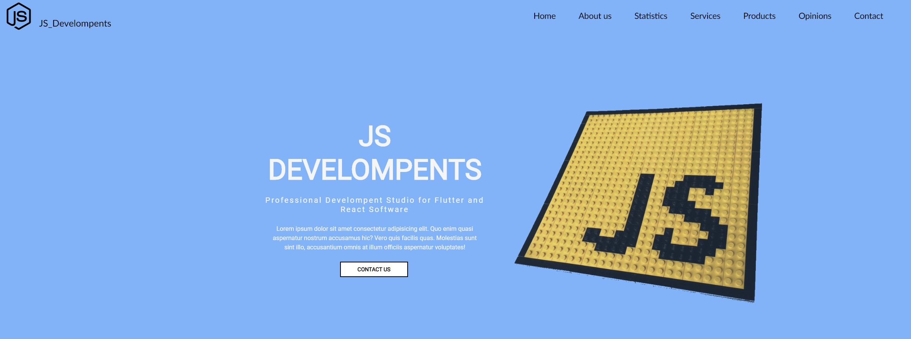

# business-website
> Simple website created with CSS, HTML, Javascript and PHP

## Table of contents
* [General info](#general-info)
* [Screenshots](#screenshots)
* [Technologies](#technologies)
* [Setup](#setup)
* [Status](#status)

## General info
Project was made as a template for future business websites 

## Screenshots

## Technologies
HTML5
CSS3
Javascript
PHP

## Setup
1.Download files and open it as localhost using for example XAMPP. 

2.In visual studio code using the extension "Live Server".

3.Download files and open the file "index.html", which is in "src" folder.

## Status
Project is: _in progress_

